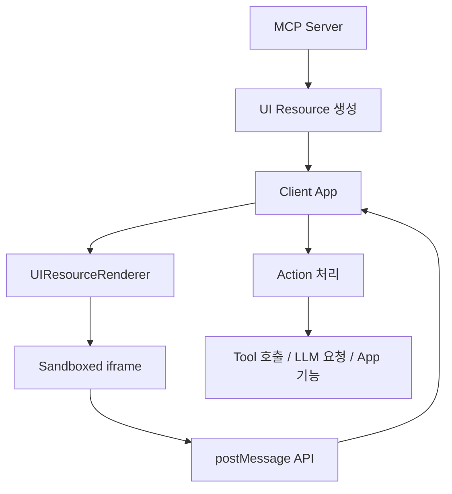
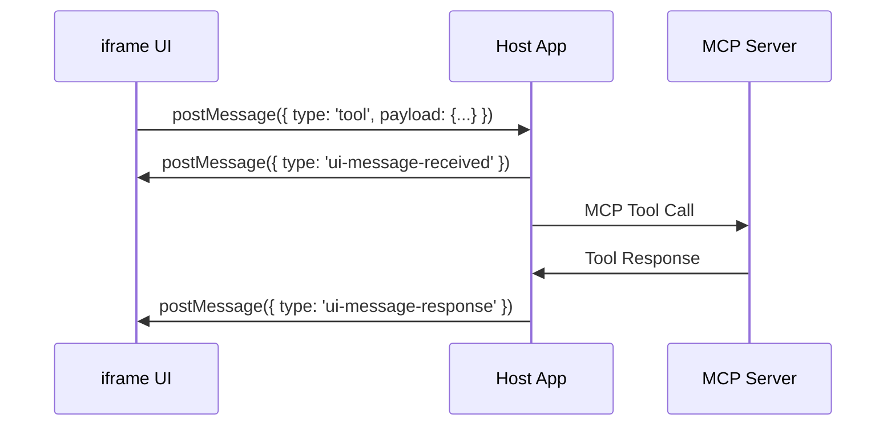

# MCP UI 개발자 가이드

## 📖 개요

**MCP UI**는 Model Context Protocol(MCP)에 인터랙티브한 웹 UI 컴포넌트를 추가하는 실험적 프로젝트입니다. MCP 서버에서 직접 UI 리소스를 생성하고, 클라이언트에서 안전하게 렌더링할 수 있게 해줍니다.

> ⚠️ **실험적 프로젝트**: 빠른 반복과 개선이 진행중인 커뮤니티 프로젝트입니다.

## 🏗️ 아키텍처



## 💡 핵심 개념

### 1. UI Resource

MCP 서버에서 클라이언트로 전달되는 UI 컴포넌트의 표준 형태:

```typescript
interface UIResource {
  type: 'resource';
  resource: {
    uri: string;        // 고유 식별자 (예: ui://component/id)
    mimeType: string;   // 렌더링 방식 결정
    text?: string;      // 인라인 컨텐츠
    blob?: string;      // Base64 인코딩된 컨텐츠
  };
}
```

### 2. 지원되는 컨텐츠 타입

| MIME Type | 설명 | 용도 |
|-----------|------|------|
| `text/html` | HTML 컨텐츠 | 자체 포함된 HTML UI |
| `text/uri-list` | 외부 URL | 외부 웹앱 임베딩 |
| `application/vnd.mcp-ui.remote-dom` | Remote DOM 스크립트 | 호스트와 일치하는 네이티브 UI |

### 3. UI Action 시스템

UI에서 발생하는 사용자 인터랙션을 처리하는 5가지 액션 타입:

```typescript
type UIAction = 
  | { type: 'tool', payload: { toolName: string, params: Record<string, unknown> } }
  | { type: 'prompt', payload: { prompt: string } }
  | { type: 'intent', payload: { intent: string, params: Record<string, unknown> } }
  | { type: 'notify', payload: { message: string } }
  | { type: 'link', payload: { url: string } }
```

## 🖥️ 서버측 구현

### TypeScript 서버

```typescript
import { createUIResource } from '@mcp-ui/server';

// 1. HTML 리소스 생성
const htmlResource = createUIResource({
  uri: 'ui://dashboard/1',
  content: { 
    type: 'rawHtml', 
    htmlString: `
      <div style="padding: 20px;">
        <h2>대시보드</h2>
        <button onclick="callTool()">데이터 새로고침</button>
        <script>
          function callTool() {
            window.parent.postMessage({
              type: 'tool',
              payload: { toolName: 'refreshData', params: {} }
            }, '*');
          }
        </script>
      </div>
    `
  },
  encoding: 'text'
});

// 2. 외부 URL 리소스
const urlResource = createUIResource({
  uri: 'ui://external/chart',
  content: { 
    type: 'externalUrl', 
    iframeUrl: 'https://charts.example.com/embed'
  },
  encoding: 'text'
});

// 3. Remote DOM 리소스
const remoteDomResource = createUIResource({
  uri: 'ui://native/button',
  content: {
    type: 'remoteDom',
    script: `
      const button = document.createElement('ui-button');
      button.setAttribute('label', '클릭하세요');
      button.addEventListener('press', () => {
        window.parent.postMessage({ 
          type: 'intent', 
          payload: { intent: 'create-task', params: { title: '새 작업' } }
        }, '*');
      });
      root.appendChild(button);
    `,
    framework: 'react'
  },
  encoding: 'text'
});
```

### Ruby 서버

```ruby
require 'mcp_ui_server'

html_resource = McpUiServer.create_ui_resource(
  uri: 'ui://greeting/1',
  content: { 
    type: :raw_html, 
    htmlString: '<div><h1>안녕하세요!</h1></div>' 
  },
  encoding: :text
)
```

## 📱 클라이언트측 구현

### React 컴포넌트

```tsx
import React from 'react';
import { UIResourceRenderer } from '@mcp-ui/client';

function MCPUIComponent({ resource }) {
  const handleUIAction = (action) => {
    switch (action.type) {
      case 'tool':
        // MCP 서버의 툴 호출
        callMCPTool(action.payload.toolName, action.payload.params);
        break;
        
      case 'prompt':
        // LLM에 프롬프트 전달
        sendToLLM(action.payload.prompt);
        break;
        
      case 'intent':
        // 구조화된 명령 처리
        if (action.payload.intent === 'create-task') {
          openTaskCreationDialog(action.payload.params);
        } else {
          // 알 수 없는 intent는 LLM에게 위임
          sendToLLM(`사용자 의도: ${action.payload.intent}`);
        }
        break;
        
      case 'notify':
        // 알림 표시
        showNotification(action.payload.message);
        break;
        
      case 'link':
        // 외부 링크 열기
        window.open(action.payload.url, '_blank');
        break;
    }
  };

  if (resource.uri?.startsWith('ui://')) {
    return (
      <UIResourceRenderer
        resource={resource}
        onUIAction={handleUIAction}
        autoResizeIframe={true}
      />
    );
  }

  return <div>지원되지 않는 리소스</div>;
}
```

### Web Component

```html
<ui-resource-renderer
  resource='{"mimeType": "text/html", "text": "<h1>Hello World</h1>"}'
></ui-resource-renderer>

<script>
document.querySelector('ui-resource-renderer')
  .addEventListener('onUIAction', (event) => {
    console.log('Action:', event.detail);
  });
</script>
```

## 🔄 통신 프로토콜

### iframe ↔ Parent 통신

UI는 sandboxed iframe 내에서 실행되며, `postMessage` API를 통해 통신합니다:

```javascript
// iframe에서 parent로 메시지 전송
window.parent.postMessage({
  type: 'tool',
  messageId: 'unique-id-123', // 비동기 추적용 (선택사항)
  payload: {
    toolName: 'searchFiles',
    params: { query: 'readme' }
  }
}, '*');

// parent에서 iframe으로 응답 전송
iframe.contentWindow.postMessage({
  type: 'ui-message-response',
  messageId: 'unique-id-123',
  payload: {
    response: { files: [...] }
  }
}, '*');
```

### 메시지 생명주기



## 🛠️ 실제 구현 예시

### 파일 관리 UI

```typescript
// 서버: 파일 브라우저 UI 생성
const fileManagerUI = createUIResource({
  uri: 'ui://file-manager/1',
  content: { 
    type: 'rawHtml', 
    htmlString: `
      <div id="file-manager">
        <h3>파일 관리자</h3>
        <div id="file-list"></div>
        <button onclick="loadFiles()">파일 목록 새로고침</button>
      </div>
      
      <script>
        function loadFiles() {
          window.parent.postMessage({
            type: 'tool',
            messageId: 'load-files-' + Date.now(),
            payload: { toolName: 'listFiles', params: {} }
          }, '*');
        }
        
        window.addEventListener('message', (event) => {
          if (event.data.type === 'ui-message-response') {
            const files = event.data.payload.response;
            displayFiles(files);
          }
        });
        
        function displayFiles(files) {
          const list = document.getElementById('file-list');
          list.innerHTML = files.map(file => 
            '<div onclick="openFile(\'' + file.name + '\')">' + file.name + '</div>'
          ).join('');
        }
        
        function openFile(filename) {
          window.parent.postMessage({
            type: 'intent',
            payload: { intent: 'open-file', params: { filename } }
          }, '*');
        }
      </script>
    `
  },
  encoding: 'text'
});
```

### 클라이언트: Action 처리

```typescript
const handleUIAction = async (action) => {
  switch (action.type) {
    case 'tool':
      try {
        const result = await mcpClient.callTool(
          action.payload.toolName, 
          action.payload.params
        );
        
        // messageId가 있으면 응답을 iframe에 전송
        if (action.messageId) {
          iframe.contentWindow.postMessage({
            type: 'ui-message-response',
            messageId: action.messageId,
            payload: { response: result }
          }, '*');
        }
      } catch (error) {
        if (action.messageId) {
          iframe.contentWindow.postMessage({
            type: 'ui-message-response',
            messageId: action.messageId,
            payload: { error: error.message }
          }, '*');
        }
      }
      break;
      
    case 'intent':
      if (action.payload.intent === 'open-file') {
        openFileInEditor(action.payload.params.filename);
      }
      break;
  }
};
```

## 🔒 보안 고려사항

1. **Sandboxed iframe**: 모든 UI 코드는 격리된 iframe에서 실행
2. **Origin 검증**: postMessage 이벤트의 origin 확인 필요
3. **Input 검증**: UI에서 전달받는 모든 데이터 검증
4. **CSP 적용**: Content Security Policy로 추가 보안 강화

```typescript
// Origin 검증 예시
window.addEventListener('message', (event) => {
  // 신뢰할 수 있는 origin인지 확인
  if (event.origin !== expectedOrigin) {
    return;
  }
  
  handleUIAction(event.data);
});
```

## 📋 체크리스트

### MCP 서버 개발자

- [ ] UI Resource 생성 로직 구현
- [ ] 적절한 MIME Type 선택
- [ ] URI 네이밍 규칙 정의
- [ ] 사용자 액션에 대한 응답 로직

### MCP 클라이언트 개발자  

- [ ] UIResourceRenderer 컴포넌트 통합
- [ ] 5가지 액션 타입 처리 로직 구현
- [ ] 비동기 메시지 추적 시스템 (messageId)
- [ ] 보안 검증 (origin, input validation)
- [ ] 에러 처리 및 사용자 피드백

### 공통

- [ ] UI와 비즈니스 로직 분리
- [ ] 적절한 로딩 상태 처리
- [ ] 접근성 고려사항
- [ ] 크로스 브라우저 호환성 테스트

## 🎯 Best Practices

1. **간단하게 시작**: HTML 타입부터 시작해서 점진적으로 Remote DOM으로 발전
2. **상태 관리**: UI 상태와 비즈니스 로직을 명확히 분리
3. **에러 처리**: 네트워크 오류, 권한 오류 등에 대한 적절한 fallback 제공
4. **성능 최적화**: 필요시에만 UI 리소스 생성, 적절한 캐싱 전략
5. **사용자 경험**: 로딩 상태, 성공/실패 피드백 제공

---

## 🔗 추가 리소스

- [MCP UI 공식 문서](https://mcpui.dev)
- [GitHub 리포지토리](https://github.com/idosal/mcp-ui)
- [예제 프로젝트들](https://github.com/idosal/mcp-ui/tree/main/examples)
- [UI Inspector](https://github.com/idosal/ui-inspector) - 로컬 테스트 도구
